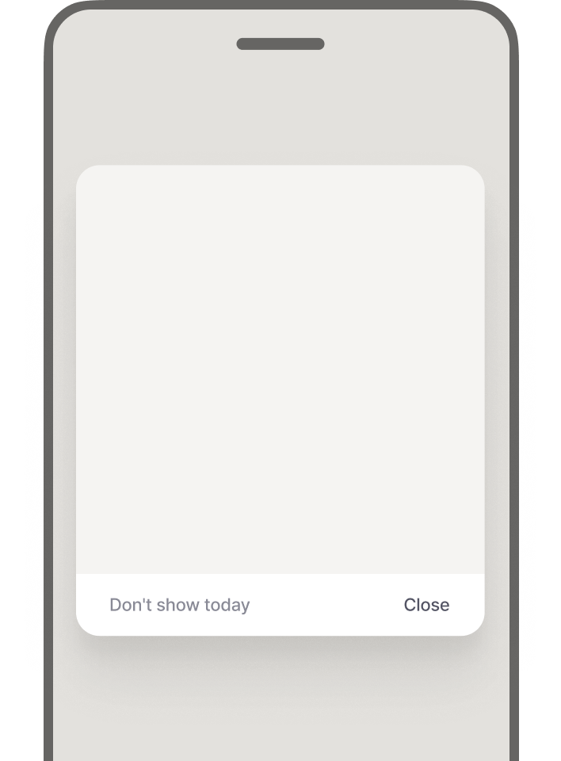

# 광고 유닛 포맷

애드컨트롤에서 지원하는 6가지 광고 유닛 포맷을 소개합니다.

## 포맷 선택 가이드

| 목적 | 추천 포맷 |
|------|----------|
| 지속적인 노출 | 배너 |
| 높은 주목도 | 전면, 스플래시 |
| 유저 보상 제공 | 보상형 |
| 자연스러운 노출 | 네이티브 |
| 이벤트/프로모션 | 팝업 |

---

## 배너 (Banner)

[▶ 영상 보기](./assets/ad-unit-banner.mp4)

고정 영역에 표시되는 직사각형 광고입니다. 가장 보편적인 형태로, 화면 상단이나 하단에 띠 형태로 노출됩니다.

**사이즈**

| 사이즈 | 설명 |
|--------|------|
| 320x50 | 모바일 기본 배너 |
| 320x100 | 모바일 대형 배너 |
| 300x250 | 미디엄 렉탱글 |
| 375x80 | 와이드 배너 |
| 16:9 | 동영상 (가로형) |
| 9:16 | 동영상 (세로형) |
| 커스텀 | 직접 사이즈 지정 |

배너는 동영상 소재도 지원합니다. 자세한 내용은 [동영상 광고 유닛](./video.md)을 참고하세요.

### 배너 템플릿

템플릿을 사용하면 광고 소재 주변에 배경과 여백이 자동으로 적용됩니다. 소재 크기가 광고 유닛보다 작을 때 빈 공간을 자연스럽게 채워줍니다.

**배경색**

템플릿을 사용하지 않는 경우, 배경색을 직접 설정할 수 있습니다. 앱이나 웹사이트의 디자인과 어울리는 색상을 선택하세요.

### 캐러셀 배너

여러 캠페인이 집행될 경우 캐러셀이 활성화되어 광고가 순환 노출됩니다. 고정 순서로 노출하면 첫 번째 광고에 성과가 집중되므로, 이를 방지하기 위해 랜덤 순서로 노출됩니다.

> ⚠️ 동영상 배너는 캐러셀을 사용할 수 없습니다.

**캐러셀 활성화**

광고 유닛 생성 시 캐러셀 사용 여부를 선택합니다.

| 상황 | 동작 |
|------|------|
| 캠페인이 여러 개 | 캐러셀이 생성되어 광고가 롤링되며 노출 |
| 단일 캠페인에 소재가 여러 개 | 캐러셀 없이 소재가 동일 비율로 랜덤 노출 |

**인디케이터 표시**

현재 광고가 몇 번째인지 표시합니다. 오른쪽 하단에 "현재 위치/총 개수" 형식으로 나타납니다. (예: 1/3)

**롤링 시간**

캐러셀이 자동으로 전환되는 주기입니다. 기본값은 3초이며, 광고당 3~4초를 권장합니다.

**운영 정책**

| 항목 | 내용 |
|------|------|
| 최대 광고 개수 | 20개 |
| 활성화 조건 | 2개 이상의 광고가 있어야 캐러셀 동작 |

---

### 캐러셀, 정말 효과적일까요?

한정된 공간에 여러 광고를 보여줄 수 있어 효율적으로 보이지만, 실제 수익화 데이터와 사용자 심리를 살펴보면 기대만큼 효과적이지 않습니다.

**뷰어빌리티(Viewability) 하락**

첫 번째 슬라이드만 노출 효과가 있습니다. 유저는 다음 슬라이드로 넘어가는 3~5초를 기다리지 않고 빠르게 스크롤합니다. 뒤쪽 광고는 로딩은 되지만 실제로 보이지 않는 '유령 노출'이 발생하여, 장기적으로 입찰 단가가 낮아질 수 있습니다.

**분산된 집중력**

정적인 배너 하나가 명확한 메시지를 전달할 때 클릭률(CTR)이 가장 높습니다. 이미지가 계속 바뀌고 메시지가 여러 개 롤링되면, 유저는 정보 처리에 피로감을 느껴 오히려 시선을 거두게 됩니다.

**배너 블라인드 현상**

유저는 '움직이는 슬라이더'를 광고 영역으로 인식하고 무시하는 경향이 있습니다. 콘텐츠에 자연스럽게 녹아드는 네이티브 광고에 비해 주목도가 떨어집니다.

**권장 대안**

| 방식 | 설명 |
|------|------|
| 단일 배너 | 가장 성과가 좋은 광고를 고정 노출하여 클릭률 향상 |
| 별도 광고 유닛 추가 | 캐러셀 대신 다른 위치에 광고 유닛을 추가하여 노출 기회 확보 |

> 💡 캐러셀은 '공간 효율성'은 좋지만 '광고 효율성(수익)'은 떨어집니다. 수익 극대화가 목표라면 단일 배너를 권장합니다.

---

## 스플래시 (Splash)

[▶ 영상 보기](./assets/ad-unit-splash.mp4)

앱 처음 시작할 때 표시되는 광고입니다. 전체 화면을 차지하여 브랜드 첫인상 효과가 뛰어납니다.

**사이즈**

| 사이즈 | 설명 |
|--------|------|
| 360x270 | 기본 사이즈 |

**옵션**

| 옵션 | 설명 |
|------|------|
| 배경색 | 스플래시 배경색 설정 |
| 노출 시간 | 광고가 표시되는 시간 |
| 다크 모드 | 다크 모드용 소재 지원 |

**특징**

| 항목 | 내용 |
|------|------|
| 노출형 상품 | 클릭을 지원하지 않으며, 리포트에서 클릭수는 0으로 표시 |
| 사전 로딩 | 캠페인 시작 72시간 전부터 사용자 기기에 광고 정보 사전 저장 |

> ⚠️ **사전 로딩 주의사항**: 소재 변경 시 즉시 반영되지 않을 수 있습니다. 캠페인 시작 72시간 전에 소재를 확정하고 심사를 완료하세요.

---

## 팝업 (Popup)

[▶ 영상 보기](./assets/ad-unit-popup.mp4)

화면 일부에 팝업으로 표시되는 광고입니다. 하단 또는 중앙에 노출되며, 화면을 가리며 등장하기 때문에 가시성이 높습니다.

**사이즈**

| 사이즈 | 설명 |
|--------|------|
| 360x240 | 하단 소형 |
| 360x450 | 하단 대형 |
| 360x360 | 중앙 정사각형 |
| 커스텀 | 직접 사이즈 지정 (하단/중앙) |

### 템플릿

팝업 광고는 두 가지 템플릿을 제공합니다.

| 템플릿 | 설명 |
|--------|------|
| 광고 성과 최적화 | 클릭 유도가 강화된 템플릿, CTA 버튼 위치 선택 가능 |
| 오늘 그만 보기 | 사용자가 광고를 닫기 편리한 형태의 템플릿 |

### 닫기 옵션

**외부 영역 눌러 닫기**

| 설정 | 동작 |
|------|------|
| ON | 광고 외부 영역 터치 시 광고 닫힘 |
| OFF | 닫기 버튼으로만 광고 닫기 가능 |

**외부 영역 배경 밝기**

팝업 뒤의 배경 어둡기를 조절합니다. 80(어두움), 55(중간), 30(밝음) 중 선택할 수 있습니다.

**오늘 그만 보기**

| 옵션 | 설명 |
|------|------|
| 오늘 광고 그만보기 | 해당 광고 유닛 전체를 오늘 하루 노출하지 않음 |
| 오늘 이 광고 그만보기 | 해당 캠페인만 오늘 하루 노출하지 않음 |

### 팝업 캐러셀

여러 캠페인이 집행될 경우 캐러셀 형태로 광고가 순환 노출됩니다.

**캐러셀 노출 개수 제한**

| 설정 | 동작 |
|------|------|
| OFF | 최대 20개까지 노출 (시스템 기본값) |
| ON | 1~20개 사이에서 최대 개수 지정 (기본값 5) |

> 💡 **광고 효율 팁**: 캐러셀 개수를 3~4개로 제한하면 유저의 집중도가 높아져 클릭률이 향상됩니다.

**노출 우선순위**

노출 가능한 광고가 캐러셀 제한 수를 초과하면, 다음 우선순위에 따라 선택적으로 노출됩니다.

| 우선순위 | 기준 |
|----------|------|
| 1 | 타겟팅이 설정된 광고 우선 |
| 2 | 타겟팅 모수가 적은 광고 우선 |
| 3 | 캠페인 진행률이 낮은 광고 우선 |
| 4 | CPP 광고는 랜덤 노출 |

> ⚠️ **CPP 구좌제 주의**: 캐러셀 제한 수가 판매된 구좌 수보다 적으면 광고가 임의로 선택되어 노출됩니다. 캐러셀 수가 많아지면 광고 효율이 떨어지므로, 구좌 수를 캐러셀 제한에 맞춰 조정하는 것을 권장합니다.

---

## 네이티브 (Native)

[▶ 영상 보기](./assets/ad-unit-native.mp4)

앱이나 웹사이트의 콘텐츠 디자인과 자연스럽게 어우러지는 광고입니다. 뉴스 피드 사이에 있는 기사형 광고가 대표적이며, UI를 자유롭게 커스터마이징할 수 있습니다.

**사이즈**

| 사이즈 | 설명 |
|--------|------|
| 360x360 | 정사각형 |
| 커스텀 | 직접 사이즈 지정 |
| 이미지 없음 | 텍스트만 노출 |

### 템플릿 옵션

**행동 유도 버튼(CTA) 표시**

유저가 광고를 클릭해 이동할 수 있도록 하는 버튼입니다. 활성화하면 광고주가 CTA 텍스트를 직접 선택할 수 있습니다.

**광고주 프로필 표시**

광고 상단에 광고주 정보(로고, 이름)를 표시합니다. 소재에 광고주 정보가 필요하지 않은 경우 비활성화할 수 있습니다.

**AD 마크 표시**

광고 우측 상단에 'AD' 워터마크를 표시하여 유저가 광고임을 인지할 수 있도록 합니다. 비활성화하면 유저가 광고로 인식하지 못할 수 있습니다.

### 광고 텍스트 항목

| 항목 | 설명 |
|------|------|
| 제목 (Title) | 광고 제목, 글자 수 제한 설정 가능 |
| 설명 (Description) | 광고 본문, 글자 수 제한 설정 가능 |

### 추가 텍스트 항목

배경색, 태그, 게시 날짜, 참여 지표 등 부가 정보를 위한 커스텀 필드를 설정할 수 있습니다.

> 💡 광고라는 느낌이 적어 유저의 거부감을 최소화할 수 있습니다. 배너형, 게시물 목록형 등 앱의 디자인 시스템에 맞게 자유롭게 구현하세요.

---

## 전면 (Interstitial)

앱/웹의 화면을 가리는 전체 화면 광고입니다. 주로 게임의 레벨이 끝날 때나 페이지가 전환되는 시점처럼 사용자 활동이 일시적으로 멈출 때 노출됩니다.

**사이즈**

| 사이즈 | 설명 |
|--------|------|
| 320x480 | 풀 이미지 타입, 전체 화면을 광고 이미지로 채움 |
| 360x360 | 구조화된 레이아웃, 제목/내용/CTA 버튼 포함 |
| 16:9 | 동영상 (가로형) |
| 9:16 | 동영상 (세로형) |

### 닫기 버튼 지연 시간

광고가 노출된 후 닫기 버튼이 나타나기까지의 시간을 설정합니다. 지연 시간 동안 유저는 광고를 닫을 수 없으므로, 적절한 시간을 설정하여 광고 효과와 유저 경험의 균형을 맞추세요.

> 💡 높은 노출과 클릭률, 전환율이 장점이지만, 너무 자주 노출하면 유저 경험(UX)을 해칠 수 있습니다.

---

## 보상형 (Rewarded)

앱 내 보상을 받는 대신 동영상 시청을 유도하는 광고입니다. 유저가 광고를 끝까지 시청하면 아이템, 포인트, 생명 등의 보상을 지급합니다. 모바일 게임에서 자주 활용됩니다.

**사이즈**

| 사이즈 | 설명 |
|--------|------|
| 9:16 | 동영상 (세로형) |

### 보상형 광고의 장점

| 대상 | 혜택 |
|------|------|
| 앱 개발자 | 높은 광고 단가와 완료율로 수익 극대화 |
| 유저 | 자발적 시청으로 거부감 없이 보상 획득 |
| 광고주 | 높은 주목도와 완전 시청 보장 |

---

## 다음 단계

👉 [동영상 광고 유닛](./video.md)에서 동영상 소재 사양과 지원 포맷을 확인하세요.
