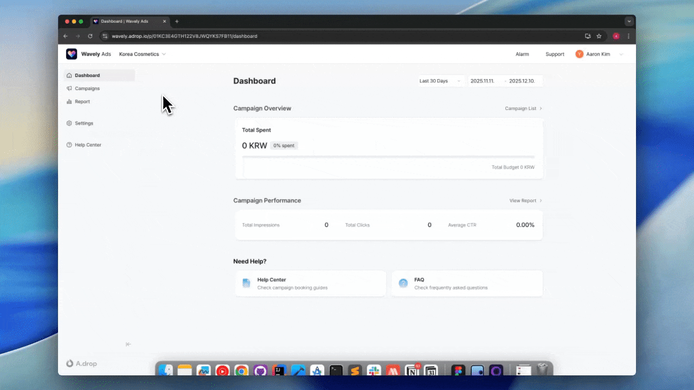

# 광고 계정 만들기

광고를 집행하려면 먼저 광고 계정을 만들어야 합니다. 이 가이드에서는 광고 플랫폼에 접속하여 광고 계정을 생성하고 결제 프로필을 설정하는 방법을 설명합니다.

---

## 광고 플랫폼 접속

매체사가 제공한 링크로 광고 플랫폼에 접속합니다.

1. 브라우저에서 광고 플랫폼 URL을 엽니다.
   - 형식: `https://{매체사도메인}.adrop.io`
2. **로그인** 또는 **회원가입**을 진행합니다.

---

## 광고 계정 생성

광고 계정은 캠페인을 예약하고 관리하는 단위입니다.

> 💡 하나의 조직에서 **여러 광고 계정**을 생성할 수 있고, **결제 프로필을 공통으로 사용**할 수 있습니다. 브랜드나 프로젝트별로 광고 계정을 분리하여 관리하세요.

### 계정 생성 방법

1. 좌측 상단의 광고 계정 이름 클릭
2. 드롭다운 메뉴 하단의 **[+ 생성]** 클릭
3. 계정 정보 입력 후 **[생성]** 클릭

생성된 광고 계정은 드롭다운에서 선택하여 전환할 수 있습니다.

### 계정 정보 입력

| 항목 | 설명 |
|------|------|
| **광고주명** | 광고주 또는 회사 이름 (2~20자). 광고 계정 이름으로 사용됩니다. |
| **웹사이트** | 광고주 웹사이트 URL (선택) |
| **국가** | 광고주 소재 국가. 세율 및 결제 통화에 영향을 줍니다. |
| **시간대** | 리포트 데이터 표시에 사용되는 시간대 |
| **언어** | 광고 플랫폼 인터페이스 언어 |

> 💡 캠페인 일정과 광고 노출은 광고 상품의 시간대를 기준으로 합니다.

---

## 결제 프로필 설정

결제 프로필은 사업자 정보와 결제 수단을 저장합니다.

> 💡 결제 프로필은 **여러 광고 계정에서 공통으로 사용**할 수 있습니다. 직접 생성하거나, 팀원에게 초대받아 함께 사용할 수 있습니다.

### 결제 프로필 생성

1. 좌측 메뉴에서 **결제 및 청구** 선택
2. **결제 프로필 추가** 클릭
3. 프로필 이름 입력 후 **생성** 클릭

### 사업자 정보 입력

| 항목 | 설명 |
|------|------|
| **국가** | 청구 국가 (한국, 일본, 인도 지원) |
| **주소** | 도시, 상세주소, 우편번호 |
| **사업자명** | 법인명 또는 상호 |
| **Tax ID** | 사업자등록번호 (숫자만 입력, 하이픈 제외) |
| **사업자등록증** | 사업자등록증 파일 업로드 (이미지 또는 PDF) |
| **대표 이메일** | 세금계산서 발행 및 정산 관련 알림 수신 이메일 |
| **참조 이메일** | 추가 수신자 이메일 (여러 개 입력 시 쉼표 또는 엔터로 구분) |

**국가별 Tax ID 및 세율**

| 국가 | Tax ID | 세율 | 세금 명칭 |
|------|--------|------|----------|
| 한국 (KR) | 사업자등록번호 (10자리) | 10% | VAT |
| 일본 (JP) | 법인번호 (10자리) | 0% | 역과세 (Reverse Charge) |
| 미국 (US) | EIN (9자리) | 0% | 역과세 (Reverse Charge) |
| 인도 (IN) | GSTIN (15자리) | 0% | 역과세 (Reverse Charge) |

> ⚠️ 한국을 제외한 해외 광고주는 **역과세(Reverse Charge)** 방식이 적용됩니다. 청구서에 세금이 포함되지 않으며, 광고주가 자국 세법에 따라 직접 세금을 신고·납부해야 합니다.

### 결제 수단 등록

| 결제사 | 지원 통화 | 설명 |
|--------|----------|------|
| **토스페이먼츠** | 원화 (KRW) | 한국 카드 결제 (개인/법인 카드) |
| **Stripe** | 다통화 | 글로벌 카드 결제 |

1. **결제 수단 추가** 버튼을 클릭합니다.
2. 결제사를 선택합니다.
3. 카드 정보를 입력합니다.
4. **등록** 버튼을 클릭합니다.

> 💡 결제 프로필은 국가가 일치하는 광고 계정에서만 사용할 수 있습니다.

---

## 결제 프로필 공유

결제 프로필을 팀원과 함께 사용하려면 멤버를 초대합니다.

1. **계정 모달** > **나의 결제 프로필**에서 공유할 프로필 선택
2. **멤버 초대** 클릭
3. 초대할 팀원의 이메일 입력
4. **초대** 클릭

초대된 멤버는 해당 결제 프로필을 자신의 광고 계정에서 사용할 수 있습니다.

---

## 광고 계정 멤버 관리

팀원을 광고 계정에 초대하여 함께 관리할 수 있습니다.

### 멤버 초대

1. 광고 계정 설정에서 **멤버 관리** 메뉴 선택
2. **멤버 초대** 클릭
3. 초대할 팀원의 이메일 입력
4. 역할 선택
5. **초대** 클릭

### 역할 권한

| 역할 | 설명 |
|------|------|
| **Owner** | 모든 권한. 결제 수단 관리, 계정 삭제, 멤버 권한 관리 가능 |
| **Editor** | 캠페인 생성/수정 가능. 삭제 및 멤버 관리 불가 |
| **Viewer** | 데이터 조회만 가능 |
| **Guest** | 대시보드 및 캠페인 성과 조회만 가능 |

> ⚠️ Owner 역할만 결제 수단을 추가하거나 삭제할 수 있습니다.

---

## 다음 단계

👉 [캠페인 예약하기](./booking.md)에서 광고 상품을 선택하고 캠페인을 예약하는 방법을 확인하세요.

---

## FAQ

**Q. 결제 프로필은 여러 광고 계정에서 사용할 수 있나요?**

네, 하나의 결제 프로필을 여러 광고 계정에서 공유할 수 있습니다. 단, 결제 프로필의 국가와 광고 계정의 국가가 일치해야 합니다.

**Q. 광고 계정을 여러 개 만들 수 있나요?**

네, 하나의 조직에서 여러 광고 계정을 생성할 수 있습니다. 브랜드나 프로젝트별로 분리하여 관리하세요.

**Q. 결제 수단을 변경하려면 어떻게 하나요?**

결제 프로필에서 새 카드를 등록하고, 캠페인 예약 시 해당 카드를 선택하면 됩니다. 기존 카드는 결제 프로필에서 삭제할 수 있습니다.
